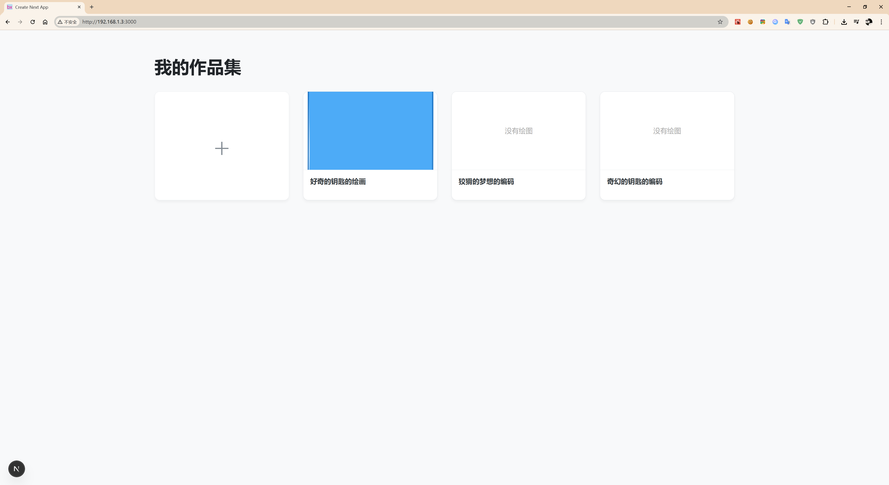

# Local-First Excalidraw - 你的私人在线画板


这是一个基于 Next.js 和 React 构建的 Web 绘图应用，灵感来源于 Excalidraw。它的核心设计理念是 **本地优先、完全私密**。所有数据都安全地存储在你自己的浏览器中，无需注册，没有云端同步，打开即用。

**[Live Demo - 在这里插入你的部署链接]**

  <!-- 建议你截个图传上来 -->


### 修改记录
- 2025-07-09 修改缩略图无法更新，修改无法删除的问题。

---

## ✨ 核心特性

- **🚀 本地优先存储**: 所有绘图数据通过 IndexedDB 存储在你的浏览器本地，加载快，离线可用，你的数据只属于你。
- **🖋️ 核心 Excalidraw 体验**: 集成了强大的 Excalidraw 组件，提供流畅自由的绘图体验。
- **🎨 项目管理**: 简洁的仪表盘，可以轻松创建、重命名和删除你的绘图页面。
- **🖼️ 缩略图自动生成**: 每个绘图项目都会自动生成内容缩略图，方便你快速识别。
- **🔗 安全的分享功能**: 可以生成一个特殊的分享链接。任何人打开链接都会在他们自己的浏览器里创建一个副本，绝不会影响你的原始绘图。
- **📄 创建副本**: 一键复制任何一个现有的绘图，方便你在旧版本的基础上进行迭代和创作。

## 🛠️ 技术栈

- **框架**: Next.js 14+ (App Router)
- **UI 库**: React 18
- **绘图核心**: `@excalidraw/excalidraw`
- **客户端数据库**: `idb` (IndexedDB 的一个轻量级封装)
- **数据压缩 (用于分享)**: `pako`
- **样式**: 全局 CSS

## 🚀 本地运行

想在本地把这个项目跑起来？非常简单：

1.  **克隆仓库**
    ```bash
    git clone https://github.com/buxuele/excalidraw-next-js-app
    ```

2.  **进入项目目录**
    ```bash
    cd excalidraw-next-js-app
    ```

3.  **安装依赖**
    ```bash
    npm install
    ```

4.  **启动开发服务器**
    ```bash
    npm run dev
    ```

现在，在你的浏览器中打开 `http://localhost:3000` 就可以看到应用了！

## 🗺️ 未来计划

我们对这个应用还有很多关于 UI 优化和功能增强的想法！详情请查看项目中的 `TODO.md` 文件。

